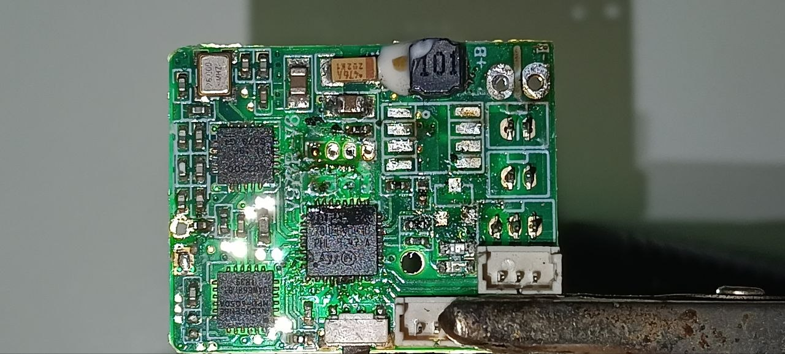
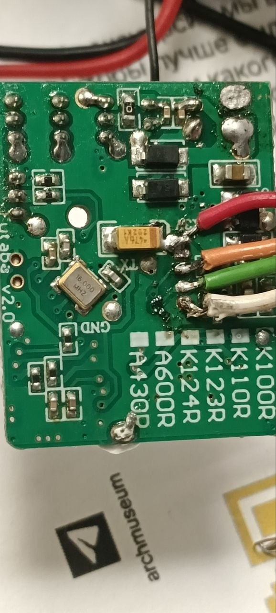

# heli-fc — replacement flight-controller firmware for a V977R-class 3D helicopter

Bare-metal firmware for the flight controller of an XK/WLtoys **V977R-V6** micro
3D helicopter (STM32F031K6). It replaces the stock firmware entirely: its own
Futaba S-FHSS receiver, IMU driver, orientation filter, stabilization loops, and
a brushless-ESC output stage in place of the original brushed motor drive.

Written from scratch. The stock firmware was studied to learn the radio protocol
and the board's wiring; none of it is copied here, and none of it is
redistributed — see [Stock firmware](#stock-firmware).

**→ [Flashing and first setup](docs/FLASHING.md)** — what it runs on, what you
need, how to build, flash, verify, and configure a transmitter.

---

## ⚠️ Safety

**This flies a real aircraft with carbon blades at several thousand RPM. Treat
every build as unverified until you have proven it on your own bench.**

- Nothing here has been validated for anyone else's airframe, ESC, or transmitter.
- There is deliberately **no arming gate**: the motors run whenever throttle-cut
  is off and the receiver has signal. Bench with the blades off.
- Change **one variable per flight**. This project has been burned repeatedly by
  two-at-a-time changes.
- After any change to signs, gains, or mixing, re-check swash and tail direction
  on the bench with the rotor stopped.

No warranty. If you fly it, you own the outcome.

---

## What this is

The helicopter this runs on is a toy, and like most toys it ships as a sealed
box: a proprietary firmware image, an undocumented 2.4 GHz link, and no way to
change how it flies. This project opens all of that.

Three things had to be recovered before a line of replacement code could work.
**The radio** is Futaba S-FHSS, a frequency-hopping protocol with no public
specification — the receiver here was rebuilt from analysing the stock image and
watching a live CC2500 answer over SWD. **The board** was mapped by
continuity-testing every pin of the LQFP32 package against photographs, which is
how the IMU turned out to be on I2C rather than SPI and to be an ICM-20689
wearing an MPU-6050 marking. **The control law** was read out of the original
firmware and then rebuilt properly, which is a longer story than it sounds:
driving the swashplate straight from an attitude PID produces a 6–8 Hz limit
cycle, so the cyclic runs as a cascade instead.

The result is not a clone of the stock behaviour. The brushed motor drive is
gone in favour of brushless ESCs, the loop rates and filters are different, and
the flight modes are the ones a 3D pilot actually wants.

## How it works

Everything runs from a single main loop on a 48 MHz Cortex-M0 with **no
floating-point unit and no math library**, which shapes most of the design.

- **Radio.** The CC2500 is driven over bit-banged SPI and polled from the main
  loop — no interrupt line is available, so the driver watches the chip's FIFO
  counter. S-FHSS hops 30 channels between 2404 and 2447.5 MHz on a 6801 µs
  slot, and each slot carries two frames: channels 1–4, then channels 5–8 about
  1.6 ms later on the same frequency. Hopping the moment the first frame lands
  loses the second one permanently, which is why collective appeared dead for a
  long time.
- **Clock.** A 16 MHz crystal on the underside of the board drives the PLL to
  48 MHz. The internal RC oscillator reaches the same 48 MHz but is only ~1%
  accurate and drifts with temperature — about ±17 µs of walk across that
  1681 µs hop window, which the link notices. Crystal start-up is bounded by a
  timeout with a fallback to the internal path, so a dead crystal degrades the
  aircraft instead of bricking it.
- **Sensing.** The IMU is read over bit-banged I2C, which is *blocking*: a full
  accel+gyro burst costs about 4.8 ms out of a 6.8 ms radio slot. Reading it
  naively starves the receiver — measured slot loss went from 3% to 57%. So the
  gyro is read alone at 100 Hz, the accelerometer only every eighth tick, and
  reads are started inside the slot's quiet window. Attitude comes from a
  complementary filter using a small-angle approximation, because `atan2` is not
  affordable here.
- **Control.** Cyclic runs a cascade: attitude error becomes a commanded body
  rate, and an inner rate PID talks to the servos. A hand-computed biquad notch
  removes a 7.5 Hz airframe resonance from the rate feedback so the loop gain
  can stay useful. The tail is a heading-hold loop on a fixed-pitch rotor driven
  by an ESC, with a feedforward split into blade-drag, collective-loading, and
  spool-up terms.
- **Instrumentation.** The debug probe stops working at flight RPM — RF pickup
  kills the ST-Link — so flight data is written to a RAM ring buffer and read
  after landing with the power still on.

## Hardware

| Part | Detail |
|---|---|
| MCU | STM32F031K6 (Cortex-M0, 32 KB flash / 4 KB RAM), 48 MHz |
| Clock | 16 MHz `X1` crystal (HSE) → PLL ×3, with a timed-out fallback to HSI |
| Radio | TI CC2500, bit-banged SPI — Futaba **S-FHSS** receiver |
| IMU | InvenSense **ICM-20689** (marked MPU-6050A), bit-banged I2C |
| Outputs | 3× CCPM swash servos + main ESC on TIM2, tail ESC on TIM3, 125 Hz |
| Watchdog | IWDG active, ~60 ms — refreshed every main-loop pass |

Full pin map, the LQFP32 ledger, and the board survey are in
[`docs/heli.md`](docs/heli.md).

## The board



*Component side, photographed after the brushed motor drive was removed.*

Only three ICs and a power stage. Held with the `B+`/`B−` battery pads at the
top right and the 26 MHz can at the top left, the layout is:

```
   26 MHz can                 inductor + tantalum        B+ / B−
   (belongs to CC2500)                                   pads
        ┌───────────────────────────────────────────────────┐
        │  [26MHz]        ▪ ▪ ▪ ▪  ← SWD through-holes      │
        │                   GND CLK DIO 3V3                 │
        │  ┌────────┐                                       │
        │  │ CC2500 │        ┌──────────┐          ▭  servo │
        │  └────────┘        │ STM32F031│          ▭  / ESC │
        │                    │  K6 LQFP │          ▭  conns │
        │  ┌────────┐        └──────────┘                   │
        │  │  IMU   │                                       │
        │  └────────┘                                       │
        └───────────────────────────────────────────────────┘
```

The IMU is silkscreened `InvenSense MPU-6050A`, but it answers `WHO_AM_I` with
`0x98` — it is an **ICM-20689**. Register-compatible, so only the accepted ID
differs. Trust the die, not the marking.

**MCU orientation.** The pin-1 dot sits at the corner nearest the ST logo. With
the board held as above, pin 1 is the **bottom-left** corner: pins 1–8 run along
the bottom edge left to right, 9–16 up the right edge, 17–24 along the top edge
right to left, 25–32 down the left edge. Cross-checked against known nets —
`PB3/PB4/PB5` head toward the radio, `PB6/PB7` toward the IMU, `PA0–PA3` fan out
to the servo connectors.

### Where to solder SWD

The debug header is the row of **through-holes above the MCU**, silkscreened
`GND CLK DIO 3.3V` on the component side. Four wires, and that is the whole job.



*Back side. The `16.000 MHz` crystal is `X1`, the MCU's own oscillator, sitting
directly under the chip. The four-wire SWD pigtail is tacked to the back of the
header holes; the black and red pair at the top is the battery.*

On the reference board the pigtail was soldered from the back, with this colour
map — **beep it out before trusting these**, they are read off a photograph:

| Wire | Signal |
|---|---|
| white | `GND` |
| green | `CLK` (SWCLK → `PA14`) |
| orange | `DIO` (SWDIO → `PA13`) |
| red | `3.3 V` |

Two things worth knowing before the iron comes out:

- The red 3.3 V lead was picked up **from the rail beside the tantalum, not from
  the header hole** — easier to land and mechanically sturdier.
- **The gold through-holes near the crystal on the back are the power switch
  pins, not SWD.** They look inviting and they are the wrong holes.

The back also carries the `Futaba v2.0` silkscreen and a model checklist —
`K100R / K110R / K123R / K124R / A600R / A430R` — which is the factory using one
PCB across a family and picking firmware per model. Read
[docs/FLASHING.md](docs/FLASHING.md#1-what-it-can-be-flashed-to) before assuming
that makes this firmware portable to those aircraft.

## Status

Flying. Cyclic runs the attitude cascade described above; the tail holds
heading. Known gaps:

- **No stored bind.** The receiver adopts the first S-FHSS transmitter it hears
  on every power-up. Flash persistence is designed but not implemented.
- **No arming gate.** Deliberate, but it means the motors are live whenever
  throttle-cut is off and there is signal.
- **Stick calibration is transmitter-specific** and must be re-measured for
  yours — see [FLASHING.md](docs/FLASHING.md#stick-calibration--you-will-need-to-redo-this).

## Quick start

Requires `arm-none-eabi-gcc` and `openocd` with an ST-Link. Full detail,
including the hardware conversion this firmware assumes, is in
[docs/FLASHING.md](docs/FLASHING.md).

```sh
cd src && make
ls -l firmware.bin        # expect ~17 KB; exactly 32768 means a stale artifact

openocd -f interface/stlink.cfg -f target/stm32f0x.cfg \
  -c "init" -c "reset halt" \
  -c "flash write_image erase firmware.bin 0x08000000" \
  -c "verify_image firmware.elf" \
  -c "reset run" -c "shutdown"
```

> **Never run `verify_image` against a *running* board.** OpenOCD puts its CRC
> stub in the work area at `0x20000000` — on top of the receiver's state struct
> — and never restores it. The radio goes deaf until reset, looking exactly like
> broken RF hardware. Verify while halted, as above.

After flashing, confirm `g_clk_hse == 1` and `g_mpu_ok == 1` before anything
else; `g_mpu_ok == 0` means the IMU is dead and the machine must not fly.
Symbol addresses move on every rebuild:

```sh
arm-none-eabi-nm src/firmware.elf | grep g_
```

## Layout

```
src/        firmware: sfhss (radio), mpu6500 (IMU), orientation, stabilize, main
src/tests/  bring-up programs (blink, PWM, SPI) used to bisect the hardware
tools/      SWD readout and analysis: live link state, blackbox dump, rate FFT
docs/       FLASHING.md, board + protocol notes, tuning framework, board photos
```

`tools/` talks to a running board through OpenOCD: `read_sfhss.sh` for receiver
state, `mon_rate.tcl` for live link rate, `bb_dump.sh` and `rate_dump.sh` with
`rate_fft.py` for the on-board flight recorder and its spectrum.

## Stock firmware

The original image is **not distributed here**, and neither is its
decompilation. What is published is the analysis: register tables, protocol
structure, timings, and addresses, in [`docs/heli.md`](docs/heli.md).

To verify those findings against the same binary, dump your own from your own
board and check you have an identical image:

```sh
openocd -f interface/stlink.cfg -f target/stm32f0x.cfg \
  -c "init" -c "halt" -c "dump_image stock.bin 0x08000000 0x8000" \
  -c "shutdown"
shasum -a 256 stock.bin
# e0a985746fc2f07508f689a9bce057c762f454622b821b2f1c531dfc541e4fa5
```

## Write-up

A long-form illustrated account of the reverse engineering — the S-FHSS
teardown, the control law, the IMU, and the firmware nuances — is published as a
case study at <https://thelonius.github.io/projects/heli-anthology>.

## License

MIT — see [LICENSE](LICENSE).
